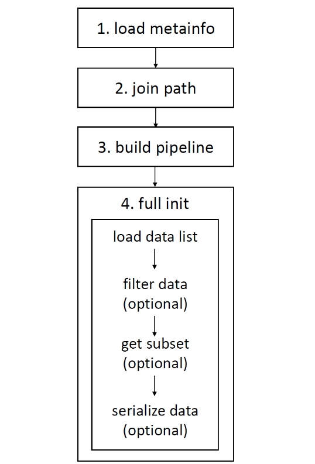
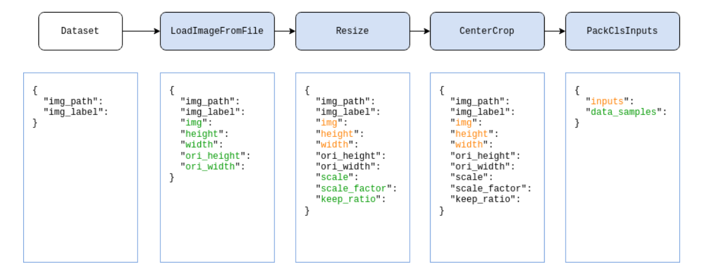

# 数据集
算法库中的数据集类负责在训练/测试过程中为模型提供输入数据，OpenMMLab 下各个算法库中的数据集有一些共同的特点和需求，比如需要高效的内部数据存储格式，需要支持数据集拼接、数据集重复采样等功能。
## 基类BaseDateset
MMEngine 实现了一个数据集基类（BaseDataset）并定义了一些基本接口，且基于这套接口实现了一些数据集包装（DatasetWrapper）。OpenMMLab 算法库中的大部分数据集都会满足这套数据集基类定义的接口，并使用统一的数据集包装。    

两类数据信息：一种是元信息 (meta information)，代表数据集自身相关的信息，有时需要被模型或其他外部组件获取，比如在图像分类任务中，数据集的元信息一般包含类别信息 classes，因为分类模型 model 一般需要记录数据集的类别信息；另一种为数据信息 (data information)，在数据信息中，定义了具体样本的文件路径、对应标签等的信息。除此之外，数据集基类的另一个功能为不断地将数据送入数据流水线（data pipeline）中，进行数据预处理。  

## OpenMMLab 2.0 数据集格式规范
OpenMMLab 2.0 数据集格式规范规定，标注文件必须为 json 或 yaml，yml 或 pickle，pkl 格式；标注文件中存储的字典必须包含 metainfo 和 data_list 两个字段。其中 metainfo 是一个字典，里面包含数据集的元信息；data_list 是一个列表，列表中每个元素是一个字典，该字典定义了一个原始数据（raw data），每个原始数据包含一个或若干个训练/测试样本。

```
{
    "metainfo":
        {
            "classes": ["cat", "dog"]
        },
    "data_list":
        [
            {
                "img_path": "xxx/xxx_0.jpg",
                "img_label": 0
            },
            {
                "img_path": "xxx/xxx_1.jpg",
                "img_label": 1
            }
        ]
}
```
同时假设数据存放路径如下
```
data
├── annotations
│   ├── train.json
├── train
│   ├── xxx/xxx_0.jpg
│   ├── xxx/xxx_1.jpg
│   ├── ...
```
## 数据集基类的初始化流程

1. load metainfo：获取数据集的元信息,一共有三种获取方式； 
- 用户实例化数据集时以参数形式传入 > 用户改动自定义数据集类中的类属性 > 标注文件中metainfo字典里的字段 （优先级从高到底）  
2. join path：处理数据与标注文件的路径；  
3. build pipeline：构建数据流水线（data pipeline），用于数据预处理与数据准备；
4. full init：完全初始化数据集类；
- oad data list：读取与解析满足 OpenMMLab 2.0 数据集格式规范的标注文件，该步骤中会调用 parse_data_info() 方法，该方法负责解析标注文件里的每个原始数据；
- filter data (可选)：根据 filter_cfg 过滤无用数据，比如不包含标注的样本等；默认不做过滤操作，下游子类可以按自身所需对其进行重写；
- get subset (可选)：根据给定的索引或整数值采样数据，比如只取前 10 个样本参与训练/测试；默认不采样数据，即使用全部数据样本；
- serialize data (可选)：序列化全部样本，以达到节省内存的效果，默认操作为序列化全部样本。  
数据集基类中包含的 parse_data_info() 方法用于将标注文件里的一个原始数据处理成一个或若干个训练/测试样本的方法。因此对于自定义数据集类，**用户需要实现 `parse_data_info()` 方法。**
## 数据集基类提供的接口
与 `torch.utils.data.Dataset` 类似，数据集初始化后，支持 `__getitem__` 方法，用来索引数据，以及 `__len__` 操作获取数据集大小，除此之外，OpenMMLab 的数据集基类主要提供了以下接口来访问具体信息：  
- metainfo：返回元信息，返回值为字典
- get_data_info(idx)：返回指定 idx 的样本全量信息，返回值为字典
- `__getitem__(idx)`：返回指定 idx 的样本经过 pipeline 之后的结果（也就是送入模型的数据），返回值为字典
- `__len__()`：返回数据集长度，返回值为整数型
- `get_subset_(indices)`：根据 indices **以 inplace 的方式修改原数据集类**。如果 indices 为 int，则原数据集类只包含前若干个数据样本；如果 indices 为 `Sequence[int]`，则原数据集类包含根据 `Sequence[int]` 指定的数据样本。
- `get_subset(indices)`：根据 indices **以非 inplace 的方式返回子数据集类，即重新复制一份子数据集**。如果 indices 为 int，则返回的子数据集类只包含前若干个数据样本；如果 indices 为 Sequence[int]，则返回的子数据集类包含根据 `Sequence[int]` 指定的数据样本。  
## 在Detection下游任务中使用BaseDataset自定义数据集类


# 数据变换
在 OpenMMLab 算法库中，数据集的构建和数据的准备是相互解耦的。通常，数据集的构建只对数据集进行解析，记录每个样本的基本信息；而数据的准备则是通过一系列的数据变换，根据样本的基本信息进行数据加载、预处理、格式化等操作。 

MMEngine 中仅约定了数据变换类的规范，常用的数据变换类实现及基类都在 MMCV 中，因此在本篇教程需要提前安装好 MMCV。  
```
import numpy as np
from mmcv.transforms import Resize
transform = Resize(scale=(224, 224))
data_dict = {'img': np.random.rand(256, 256, 3)}
data_dict = transform(data_dict)
print(data_dict['img'].shape) # (224, 224, 3)
```
我们将一系列数据变换组合成为一个列表，称为数据流水线（Data Pipeline），传给数据集的 pipeline 参数。  
1.数据加载，通常使用 LoadImageFromFile  
2.标签加载，通常使用 LoadAnnotations  
3.数据处理及增强，例如 RandomResize  
4.数据格式化，根据任务不同，在各个仓库使用自己的变换操作，通常名为 PackXXXInputs，其中 XXX 是任务的名称，如分类任务中的 PackClsInputs。
  
```
# 对应的pipeline参数字典
pipeline = [
            dict(type='LoadImageFromFile'),
            dict(type='Resize', size=256, keep_ratio=True),
            dict(type='CenterCrop', crop_size=224),
            dict(type='PackClsInputs'),
        ]
```
## 常用数据变换类
按照功能，常用的数据变换类可以大致分为数据加载、数据预处理与增强、数据格式化。MMCV 中提供了一系列常用的数据变换类。  
https://mmengine.readthedocs.io/zh_CN/latest/advanced_tutorials/data_transform.html
## 自定义数据变化类
要实现一个新的数据变换类，需要继承 BaseTransform，并实现 transform 方法。  
这里，我们使用一个简单的翻转变换（MyFlip）作为示例：  
```
import random
import mmcv
from mmcv.transforms import BaseTransform, TRANSFORMS

@TRANSFORMS.register_module()
class MyFlip(BaseTransform):
    def __init__(self, direction: str):
        super().__init__()
        self.direction = direction

    def transform(self, results: dict) -> dict:
        img = results['img']
        results['img'] = mmcv.imflip(img, direction=self.direction)
        return results
```
使用： 
1. 实例化MyFlip对象，并将之作为一个可调用对象，来处理我们的数据字典。 
```
import numpy as np

transform = MyFlip(direction='horizontal')
data_dict = {'img': np.random.rand(224, 224, 3)}
data_dict = transform(data_dict)
processed_img = data_dict['img']
```
2. 在配置文件的 pipeline 中使用 MyFlip 变换
```
pipeline = [
    ...
    dict(type='MyFlip', direction='horizontal'),
    ...
]
```
## 在Detection下游任务中自定义数据变换类


# 数据加载器DataLoader
MMEngine 完全支持 PyTorch 的原生 DataLoader，因此可以直接传入构建好的DataLoader, 如下面代码。   
```
train_dataloader = DataLoader(batch_size=32,
                              shuffle=True,
                              dataset=torchvision.datasets.CIFAR10(
                                  'data/cifar10',
                                  train=True,
                                  download=True))
al_dataloader = DataLoader(batch_size=32,
                            shuffle=False,
                            dataset=torchvision.datasets.CIFAR10(
                                'data/cifar10',
                                train=False,
                                download=True))
runner = Runner(
    train_dataloader=train_dataloader,
    val_dataloader=val_dataloader,
)
```
同时，借助 MMEngine 的注册机制，以上参数也可以传入 dict，如下面代码所示。字典中的键值与 DataLoader 的构造参数一一对应。在这种情况下，数据加载器会在实际被用到时，在执行器内部被构建。
```
runner = Runner(
    train_dataloader=dict(
        batch_size=32,
        sampler=dict(
            type='DefaultSampler',
            shuffle=True),
        dataset=torchvision.datasets.CIFAR10(...),
        collate_fn=dict(type='default_collate')
    )
)
```
## 配置文件构建DataLoader
在上述两个例子中，并不可以将DataLoader简单替换成dict就可以无缝切换，这是因为**基于注册机制构建时 MMEngine 会有一些隐式的转换和约定**。
### sampler 与 shuffle
MMEngine 中规定通过 dict 传入的数据加载器的配置必须包含 sampler 参数。同时，shuffle 参数也从 DataLoader 中移除，这是由于在 PyTorch 中 sampler 与 shuffle 参数是互斥的。
```
dataset = torchvision.datasets.CIFAR10(...)
sampler = DefaultSampler(dataset, shuffle=True)

runner = Runner(
    train_dataloader=DataLoader(
        batch_size=32,
        sampler=sampler,
        dataset=dataset,
        collate_fn=default_collate
    )
)

# 等价于

runner = Runner(
    train_dataloader=dict(
        batch_size=32,
        sampler=dict(
            type='DefaultSampler',
            shuffle=True),
        dataset=torchvision.datasets.CIFAR10(...),
        collate_fn=dict(type='default_collate')
    )
)
```
一个提示：上述代码的等价性只有在：1）使用单进程训练，以及 2）没有配置执行器的 randomness 参数时成立。这是由于使用 dict 传入 sampler 时，执行器会保证它在分布式训练环境设置完成后才被惰性构造，并接收到正确的随机种子。这两点在手动构造时需要额外工作且极易出错。因此，上述的写法只是一个示意而非推荐写法。我们强烈建议 sampler 以 dict 的形式传入，让执行器处理构造顺序，以避免出现问题。  
### DefaultSampler
DefaultSampler 是 MMEngine 内置的一种采样器，它屏蔽了单进程训练与多进程训练的细节差异，使得单卡与多卡训练可以无缝切换。  
采用PyTorch DistributedDataParallel用来多卡训练时，需要更换数据加载器的 sampler 参数，但在 MMEngine 中，这一细节通过 DefaultSampler 而被屏蔽。  

除了 Dataset 本身之外，DefaultSampler 还支持以下参数配置：
- shuffle 设置为 True 时会打乱数据集的读取顺序
- seed 打乱数据集所用的随机种子，通常不需要在此手动设置，会从 Runner 的 randomness 入参中读取
- round_up 设置为 True 时，与 PyTorch DataLoader 中设置 drop_last=False 行为一致。如果你在迁移 PyTorch 的项目，你可能需要注意这一点。
### collate_fn
使用配置文件构造数据加载器时，MMEngine 会默认使用内置的 pseudo_collate，这一点明显区别于 PyTorch 默认的 default_collate。    

MMengine 中提供了 2 种内置的 collate_fn：
- pseudo_collate，缺省时的默认参数。它不会将数据沿着 batch 的维度合并。详细说明可以参考 pseudo_collate
- default_collate，与 PyTorch 中的 default_collate 行为几乎完全一致，会将数据转化为 Tensor 并沿着 batch 维度合并。

## 在Detection下游任务中自定义加载器参数
### Sampler
```
@DATA_SAMPLERS.register_module()
class MySampler(Sampler):
    pass

runner = Runner(
    train_dataloader=dict(
        sampler=dict(type='MySampler'),
        ...
    )
)
```
### collate_fn
```
@FUNCTIONS.register_module()
def my_collate_func(data_batch: Sequence) -> Any:
    pass

runner = Runner(
    train_dataloader=dict(
        ...
        collate_fn=dict(type='my_collate_func')
    )
)
```
