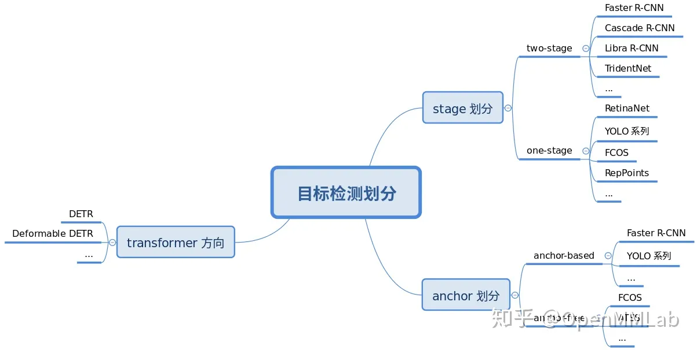
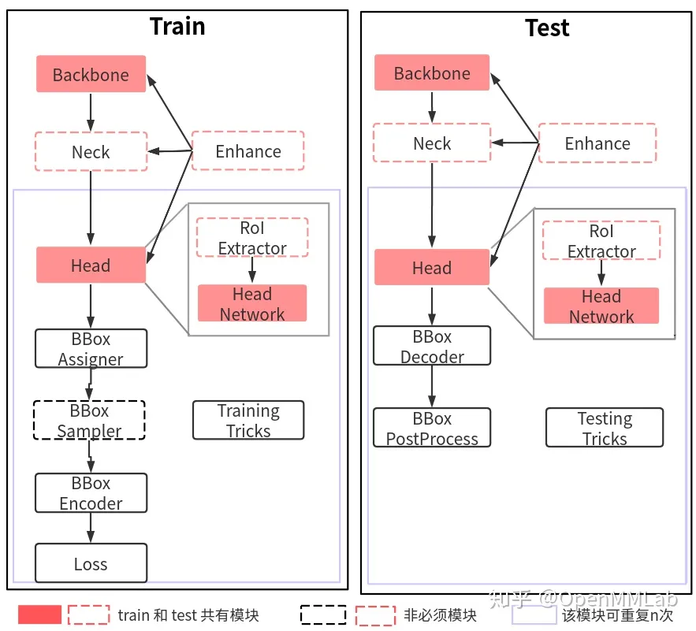

# Runner中构建模型
```
def build_model(self, model: Union[nn.Module, Dict]) -> nn.Module:
        if isinstance(model, nn.Module):
            return model
        elif isinstance(model, dict):
            model = MODELS.build(model)
            return model  # type: ignore
        else:
            raise TypeError('model should be a nn.Module object or dict, '
                            f'but got {model}')
```

# 整体构成

简单来说目标检测算法可以按照 3 个维度划分：
- 按照 stage 个数划分，常规是 one-stage 和 two-stage，但是实际上界限不是特别清晰，例如带 refine 阶段的算法 RepPoints，实际上可以认为是1.5 stage 算法，而 Cascade R-CNN 可以认为是多阶段算法，为了简单，上面图示没有划分如此细致
- 按照是否需要预定义 anchor 划分，常规是 anchor-based 和 anchor-free，当然也有些算法是两者混合的
- 按照是否采用了 transformer 结构划分，目前基于 transformer 结构的目标检测算法发展迅速，也引起了极大的关注，所以这里特意增加了这个类别的划分  

不管哪种划分方式，其实都可以分成若干固定模块，然后通过模块堆叠来构建整个检测算法体系。  

训练部分一般包括 9 个核心组件，总体流程是：
1. 任何一个 batch 的图片先输入到 backbone 中进行特征提取，典型的骨干网络是 ResNet
2. 输出的单尺度或者多尺度特征图输入到 neck 模块中进行特征融合或者增强，典型的 neck 是 FPN
3. 上述多尺度特征最终输入到 head 部分，一般都会包括分类和回归分支输出
在整个网络构建阶段都可以引入一些即插即用增强算子来增加提取提取能力，典型的例如 SPP、DCN 等等
4. 目标检测 head 输出一般是特征图，对于分类任务存在严重的正负样本不平衡，可以通过正负样本属性分配和采样控制
5. 为了方便收敛和平衡多分支，一般都会对 gt bbox 进行编码
6. 最后一步是计算分类和回归 loss，进行训练
7. 在训练过程中也包括非常多的 trick，例如优化器选择等，参数调节也非常关键

## backbone
backbone 作用主要是特征提取。具体见文件：mmdet/models/backbones
```
__all__ = [
    'RegNet', 'ResNet', 'ResNetV1d', 'ResNeXt', 'SSDVGG', 'HRNet',
    'MobileNetV2', 'Res2Net', 'HourglassNet', 'DetectoRS_ResNet',
    'DetectoRS_ResNeXt', 'Darknet', 'ResNeSt', 'TridentResNet', 'CSPDarknet',
    'SwinTransformer', 'PyramidVisionTransformer',
    'PyramidVisionTransformerV2', 'EfficientNet', 'CSPNeXt'
]
```
## neck
neck 可以认为是 backbone 和 head 的连接层，主要负责对 backbone 的特征进行高效融合和增强，能够对输入的单尺度或者多尺度特征进行融合、增强输出等。具体见文件：mmdet/models/necks
```
__all__ = [
    'FPN', 'BFP', 'ChannelMapper', 'HRFPN', 'NASFPN', 'FPN_CARAFE', 'PAFPN',
    'NASFCOS_FPN', 'RFP', 'YOLOV3Neck', 'FPG', 'DilatedEncoder',
    'CTResNetNeck', 'SSDNeck', 'YOLOXPAFPN', 'DyHead', 'CSPNeXtPAFPN', 'SSH'
]
```
# head
目标检测算法输出一般包括分类和框坐标回归两个分支，不同算法 head 模块复杂程度不一样，灵活度比较高。在网络构建方面，理解目标检测算法主要是要理解 head 模块。  

MMDetection 中 head 模块又划分为 two-stage 所需的 RoIHead 和 one-stage 所需的 DenseHead，也就是说所有的 one-stage 算法的 head 模块都在mmdet/models/dense_heads中，而 two-stage 算法还包括额外的mmdet/models/roi_heads。
```
# dense_heads 几乎每个算法都包括一个独立的 head
__all__ = [
    'AnchorFreeHead', 'AnchorHead', 'GuidedAnchorHead', 'FeatureAdaption',
    'RPNHead', 'GARPNHead', 'RetinaHead', 'RetinaSepBNHead', 'GARetinaHead',
    'SSDHead', 'FCOSHead', 'RepPointsHead', 'FoveaHead',
    'FreeAnchorRetinaHead', 'ATSSHead', 'FSAFHead', 'NASFCOSHead',
    'PISARetinaHead', 'PISASSDHead', 'GFLHead', 'CornerHead', 'YOLACTHead',
    'YOLACTProtonet', 'YOLOV3Head', 'PAAHead', 'SABLRetinaHead',
    'CentripetalHead', 'VFNetHead', 'StageCascadeRPNHead', 'CascadeRPNHead',
    'EmbeddingRPNHead', 'LDHead', 'AutoAssignHead', 'DETRHead', 'YOLOFHead',
    'DeformableDETRHead', 'CenterNetHead', 'YOLOXHead', 'SOLOHead',
    'DecoupledSOLOHead', 'DecoupledSOLOLightHead', 'SOLOV2Head', 'LADHead',
    'TOODHead', 'MaskFormerHead', 'Mask2FormerHead', 'DDODHead',
    'CenterNetUpdateHead', 'RTMDetHead', 'RTMDetSepBNHead', 'CondInstBboxHead',
    'CondInstMaskHead', 'RTMDetInsHead', 'RTMDetInsSepBNHead',
    'BoxInstBboxHead', 'BoxInstMaskHead', 'ConditionalDETRHead', 'DINOHead',
    'ATSSVLFusionHead', 'DABDETRHead'
]
```
对于two-stage 或者 mutli-stage 算法，会额外包括一个区域提取器 roi extractor，用于将不同大小的 RoI 特征图统一成相同大小。  

虽然 head 部分的网络构建比较简单，但是由于正负样本属性定义、正负样本采样和 bbox 编解码模块都在 head 模块中进行组合调用，故 MMDetection 中最复杂的模块就是 head。
